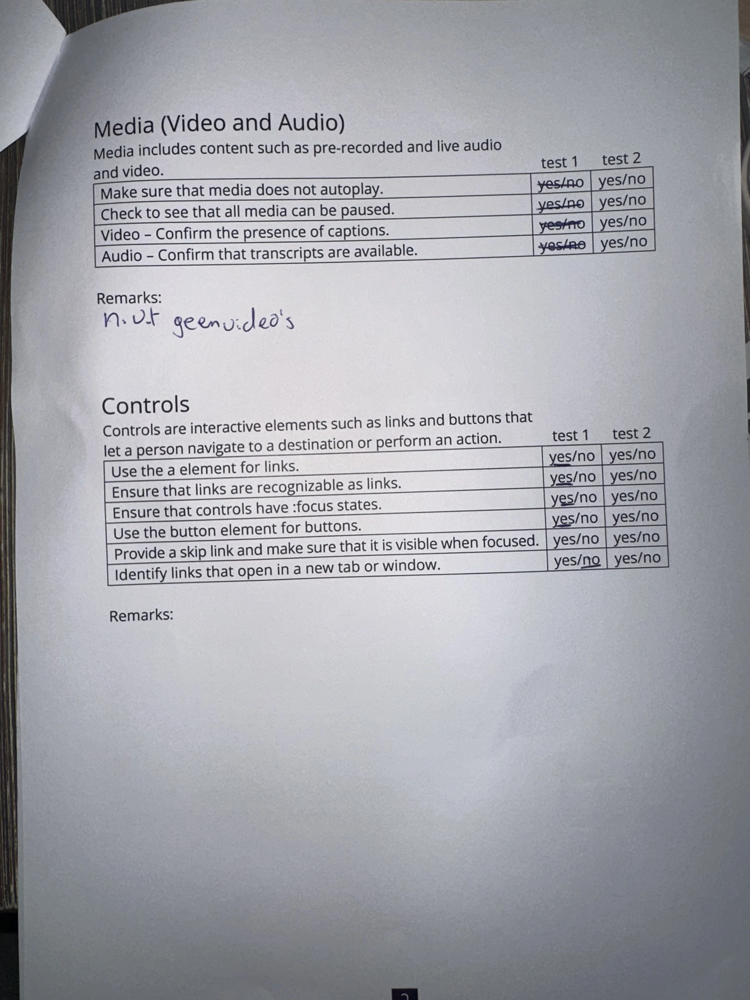

# Procesverslag
Markdown is een simpele manier om HTML te schrijven.  
Markdown cheat cheet: [Hulp bij het schrijven van Markdown](https://github.com/adam-p/markdown-here/wiki/Markdown-Cheatsheet).

Nb. De standaardstructuur en de spartaanse opmaak van de README.md zijn helemaal prima. Het gaat om de inhoud van je procesverslag. Besteedt de tijd voor pracht en praal aan je website.

Nb. Door *open* toe te voegen aan een *details* element kun je deze standaard open zetten. Fijn om dat steeds voor de relevante stuk(ken) te doen.

## Jij

  
uitwerken voor kick-off werkgroep

  ### Auteur:
  Tim Keizer

  #### Je startniveau:
  Blauw

  #### Je focus:
  hier je focus (kies uit responsive óf surface plane)
  Responsive
 

## Je website

  
uitwerken voor kick-off werkgroep

  ### Je opdracht:
  https://www.chocomel.com/nl-nl  

  #### Screenshot(s) van de eerste pagina (small screen): 
  home
  

  #### Screenshot(s) van de tweede pagina (small screen):
  Duurzaamheid pagina 
  
 
  #### Screenshot(s) van de breakdown:
  

## Toegankelijkheidstest 1/2 (week 1)

  
uitwerken na test in 2e werkgroep

  ### Bevindingen
  Lijst met je bevindingen die in de test naar voren kwamen:
  - Geen dark mode vanwege kleur gebruik
  - Screen reader werkt amper,
  - Screen reader werkt eerste 4/5 tabs en dan skipt die volledig de content
  - Website gebruikt geen h1 maar p voor gebruik van titels
  
  
  
  
  

## Breakdownschets (week 1)

  
uitwerken na afloop 3e werkgroep

  ### de hele pagina: 
  

  ### dynamisch deel (bijv menu): 
  

  ### wellicht nog een dynamisch deel (bijv filter): 
  

## Voortgang 1 (week 2)

  
uitwerken voor 1e voortgang

  ### Stand van zaken
  Ik vond het lastig om te zien hoe ik op een correcte manier de sections te selecteren zonder aand div's te denken.

  Daarbij had ik de opbouw met alle afbeeldingen snel in een mapje kunnen zetten incl fonts.

  ### Verslag van meeting
  hier na afloop snel de uitkomsten van de meeting vastleggen
  Na het eerste voortgangsgesprek ben ik de hele main vergeten neer te zetten in de html.
  Voor de rest gekeken hoe ik het beste dingen kon targeten via css voor de styling.

  Daarbij vind ik het wel lastig me te bedenken hoe ik de 2e pagina ga stylen omdat de componenten van deze pagina overeenkomen met de css van de styling van pagina 2.
 
  - Goed kijken of de html correct in elkaar zit
  - Via nth of type kan ik alle sections selecteren
  - 

## Voortgang 2 (week 3)

  
uitwerken voor 2e voortgang

  ### Stand van zaken
  Ik was de goede richting op aan het gaan en daarbij kreeg ik het advies om alles in grids te verwerken om later werk te besparen om het responsive te maken.

  Hierin begrijp ik alleen niet hoe grids goed werkt en hoe je alles kan opstellen.

  Ook heb ik me ingelezen en video's gekeken over wat intersection observer is en waarvoor het gebruikt wordt en wat je ermee kan.

  Dit wil ik gaan gebruiken om het gemakkelijk responsive te maken van het blikje dat in het midden van scherm hangt zodat die stopt in de laatste section img. Hierdoor moet ik anders voor elk formaat scherm een ander stop punt aanmaken en dit kost uiteindelijk meer tijd waarschijnlijk dan intersection observer API te gebruiken.

  ### Verslag van meeting
  hier na afloop snel de uitkomsten van de meeting vastleggen

  - afbeeldingen niet als eerst neer zetten in html, beter omdraaien en met grid weer terug naar boven werken (laatste week ben ik er achter gekomen dat dit toch niet het geval is.....).
  - Grids gebruiken voor makkelijke aanpassingen van waar wat moet komen te staan.
  - Weten wanneer je wel of niet een div mag gebruiken.
  - Het leren begrijpen van intersection observer in javascript.
  - javascript is niet mijn sterkste punt.

## Toegankelijkheidstest 2/2 (week 4)

  
uitwerken na test in 9e werkgroep

  
  
  
  
  

  ### Bevindingen
  Lijst met je bevindingen die in de test naar voren kwamen (geef ook aan wat er verbeterd is):
- Uit de test bleek dat mijn HTML nog 4 errors had
- Dark mode niet van toepassing voor vanwege de kleuren.
- 
  
  

## Voortgang 3 (week 4)

  
uitwerken voor 3e voortgang

  ### Stand van zaken
  De laatste week waarin ik flinke stappen had gemaakt omtrent het responsive maken van de website met wat valkuilen. Ik zie door alle 'restricties' semantische code veel te malen over wat wel en niet mag.

  Daarbij wist ik niet of je meerdere media breakpoints mag hebben maar dat mocht wel.

  ### Verslag van meeting
  hier na afloop snel de uitkomsten van de meeting vastleggen

  - Meerdere media niet erg voor responsive web 
  - Grids gemakkelijk aanpasbaar voor responsive
  - Css font family error maakt niet uit

## Eindgesprek (week 5)

  
uitwerken voor eindgesprek

  ### Je uitkomst - karakteristiek screenshots:
  

  ### Dit ging goed/Heb ik geleerd: 
  Korte omschrijving met plaatjes

  
  Het leren van klein beginnen naar grotere schermen en goed kijken hoe je bepaalde elementen
  op plekken krijgt waar ze horen te staan. 

  
    Voor de eerste keer eindelijk ene werkend hamburger menu kunnen coderen waar ik zeker trots op ben.
    En ook met een background image erin verwerkt die niet heel optimaal werkt maar hij is er wel.

  
  
  Het leren werken met grids in een responsive manier om bijna wat in mijn hoofd onmogelijk zou zijn te kunnen behalen.

  

  ### Dit was lastig/Is niet gelukt:
  Korte omschrijving met plaatjes

  
  er staan meerdere dingen wat niet compleet is gelukt staat op deze afbeelding, het blikje kreeg ik niet voor elkaar om te stoppen met intersection observer en daarbij had ik ook wat problemen met de social icons vast te zetten op de footer die bleven maar verspringen

  
  de navigatie is op klein scherm redelijk compleet maar tijdens scalen wordt het een bruin vlak en ik kreeg de complete pagina niet geblurred.

  
  Ik kreeg de css cirkel en de pijl niet vast op positie met de link.

  

## Bronnenlijst

  
continu bijhouden terwijl je werkt

  Nb. Wees specifiek ('css-tricks' als bron is bijv. niet specifiek genoeg). 
  Nb. ChatGpT en andere AI horen er ook bij.
  Nb. Vermeld de bronnen ook in je code.

  1. veel kennis uit https://developer.mozilla.org/en-US/ op gedaan.
  2. No scroll styling van javascript uitleg https://chatgpt.com/share/678997be-eb18-800e-be77-74cde5277e0b
  3. Intersection observer JS uitleg
  https://chatgpt.com/share/677fe3e5-668c-800e-949d-b5229f4885f0 
  4. Hoe je op een semantische manier 2 pagina's styled 
  https://chatgpt.com/share/67899842-b1c8-800e-a613-486e32471036 

